# Match STYLE - Sistem Manajemen Lemari Pakaian

## Identitas Mahasiswa

Nama & NIM :
1. Silvi Rusmiati (124005010)

## Deskripsi Aplikasi

Match STYLE merupakan aplikasi berbasis web yang dibuat menggunakan Framework Laravel, PHP, MySQL, HTML, dan Tailwind CSS. Aplikasi ini tidak hanya membantu pengguna untuk mendigitalkan isi lemari mereka, tetapi juga menyediakan ruang kreatif interaktif untuk merancang gaya pakaian sehari-hari secara virtual.

Aplikasi ini memiliki fitur lengkap mulai dari manajemen pakaian (CRUD) hingga sistem cerdas untuk memadupadankan gaya:

* Registrasi & Login Pengguna
* Dashboard User 
* Wardrobe (Melihat dan mengelola galeri isi lemari)
* Tambah Pakaian (Upload foto dan detail kategori baju)
* Edit & Hapus Pakaian (Memperbarui atau menghapus data pakaian dari lemari)
* Rekomendasi Gaya (Sistem pintar untuk memberikan saran kombinasi pakaian)
* Canvas Mix & Match (Papan interaktif untuk menyusun dan memvisualisasikan padu padan pakaian secara bebas)
* Logout

---

## Fitur Sistem (Detail)

### Autentikasi
* **Registrasi:** Pengguna dapat membuat akun baru menggunakan nama, email, dan password.
* **Login & Logout:** Akses masuk dan keluar sistem yang aman menggunakan autentikasi bawaan Laravel.

### Manajemen Lemari (Wardrobe)
* **Lihat Koleksi:** Menampilkan seluruh pakaian yang telah diunggah oleh pengguna dalam bentuk galeri yang rapi.
* **Tambah Pakaian:** Pengguna dapat mengunggah foto pakaian baru beserta kelengkapan detailnya (seperti nama pakaian dan kategori: atasan, bawahan, dll).
* **Edit Pakaian:** Pengguna dapat mengubah informasi atau detail pakaian jika terdapat kesalahan pencatatan.
* **Hapus Pakaian:** Pengguna dapat membuang/menghapus data pakaian yang mungkin sudah tidak dimiliki lagi.

### Fitur Unggulan (Styling)
* **Rekomendasi Pakaian:** Fitur yang memberikan inspirasi atau saran kombinasi gaya pakaian berdasarkan isi lemari pengguna.
* **Canvas Mix & Match:** Ruang kerja virtual (*workspace*) di mana pengguna dapat menarik (*drag/drop* atau memilih) berbagai *item* pakaian untuk melihat kecocokannya secara visual sebelum benar-benar memakainya.

## Teknologi & Arsitektur Sistem

Aplikasi ini dibangun menggunakan arsitektur **MVC (Model-View-Controller)** dengan rincian teknologi sebagai berikut:

### Frontend (Antarmuka Pengguna)
* **HTML5 & CSS3:** Struktur dasar halaman web.
* **Tailwind CSS:** *Utility-first framework* untuk mendesain *user interface* yang responsif, modern, dan rapi.
* **Blade Templating Engine:** Mesin *template* bawaan Laravel untuk menampilkan data dinamis ke dalam HTML secara efisien.

### Backend (Logika Sistem)
* **PHP:** Bahasa pemrograman *server-side* utama.
* **Laravel Framework (v11):** *Framework* andalan yang mengatur *routing*, *controller*, dan struktur keseluruhan aplikasi.
* **Eloquent ORM:** Sistem pemetaan *database* dari Laravel yang memudahkan interaksi (CRUD) dengan *database* menggunakan model *Object-Oriented*.

### Database & Penyimpanan
* **MySQL:** Sistem manajemen basis data relasional (RDBMS) untuk menyimpan data pengguna dan pakaian.
* **Local Storage / Public Disk Laravel:** Digunakan untuk menyimpan *file* gambar pakaian yang diunggah (*upload*) oleh pengguna.
* **XAMPP:** Paket perangkat lunak penyedia *server* lokal (Apache) dan MySQL.

### Keamanan (Security)
* **Bcrypt Hashing:** Digunakan untuk mengenkripsi *password* pengguna secara otomatis di *database* sehingga data *login* aman dan tidak bisa dibaca secara langsung.
* **CSRF Protection:** Perlindungan bawaan Laravel (menggunakan `@csrf`) pada setiap form untuk mencegah serangan *Cross-Site Request Forgery*.
* **Session-based Authentication:** Sistem autentikasi pengguna untuk memastikan hanya pengguna yang sudah *login* yang bisa mengakses fitur *wardrobe* dan *mix & match*.

### Tools Development
* **Visual Studio Code:** *Text editor* / IDE utama untuk menulis kode.
* **Git & GitHub:** Sistem kontrol versi (*Version Control System*) untuk menyimpan repositori dan riwayat perubahan kode.
* **Composer:** *Package manager* untuk mengelola dependensi (kumpulan *library*) PHP yang dibutuhkan oleh Laravel.

## Struktur Project

Berikut adalah beberapa file utama yang dikembangkan dalam project ini:

* `app/Http/Controllers/OutfitController.php`
* `app/Models/Outfit.php`
* `routes/web.php`
* `resources/views/outfits/create.blade.php`
* `resources/views/wardrobe.blade.php`
* `resources/views/dashboard.blade.php`
* `database/migrations/..._create_outfits_table.php`
* `.env`

## Cara Instalasi dan Menjalankan Aplikasi

1. Install XAMPP dan Composer.
2. Jalankan Apache dan MySQL pada aplikasi XAMPP.
3. Buka terminal/CMD, lalu *clone* repository ini atau *download* sebagai ZIP dan ekstrak di folder komputer.
4. Buka folder project di Visual Studio Code.
5. Buka Terminal di VS Code, jalankan perintah `composer install`.
6. Ubah nama file `.env.example` menjadi `.env`.
7. Buka phpMyAdmin di browser (`http://localhost/phpmyadmin`).
8. Buat database baru dengan nama:
   
   **match_style_db** *(atau sesuaikan dengan nama database di komputer kamu)*

9. Sesuaikan konfigurasi database pada file `.env`:
DB_CONNECTION=mysql
DB_HOST=127.0.0.1
DB_PORT=3308
DB_DATABASE=uas_outfit
DB_USERNAME=root
DB_PASSWORD=

10. Jalankan migrasi database melalui terminal VS Code dengan perintah: `php artisan migrate`
11. Jalankan *server* lokal dengan perintah: `php artisan serve`
12. Buka browser dan akses: `http://127.0.0.1:8000`
13. Registrasikan akun baru atau login menggunakan akun yang tersedia.

## Fitur Sistem

### Registrasi
Pengguna dapat membuat akun baru menggunakan nama, email, dan password.

### Login
Pengguna dapat login menggunakan email dan password yang telah didaftarkan.

### Dashboard
Menampilkan halaman sambutan dan menu utama untuk pengguna yang sedang login.

### Wardrobe
Menampilkan galeri atau daftar pakaian yang telah diunggah oleh pengguna yang sedang login.

### Tambah Pakaian
Pengguna dapat mengunggah foto pakaian baru beserta detailnya (nama dan kategori).

### Logout
Pengguna dapat keluar dari sistem dengan aman menggunakan fitur autentikasi bawaan Laravel.

## Database

Nama Database: 
**match_style_db** *(atau sesuaikan dengan nama database milikmu)*

Tabel yang digunakan:

**1. users** (Bawaan Laravel)
Kolom:
* id
* name
* email
* password
* created_at
* updated_at

**2. outfits** (Tabel Kustom)
Kolom:
* id
* user_id (Relasi ke tabel users)
* name
* category
* image
* created_at
* updated_at

## Dokumentasi Pengujian

Berikut adalah hasil pengujian antarmuka dan fitur-fitur utama pada aplikasi Match STYLE berdasarkan alur penggunaan sistem:

### 1. Halaman Utama (Landing Page)
*(Tampilan awal aplikasi saat pertama kali diakses oleh pengunjung sebelum melakukan login)*

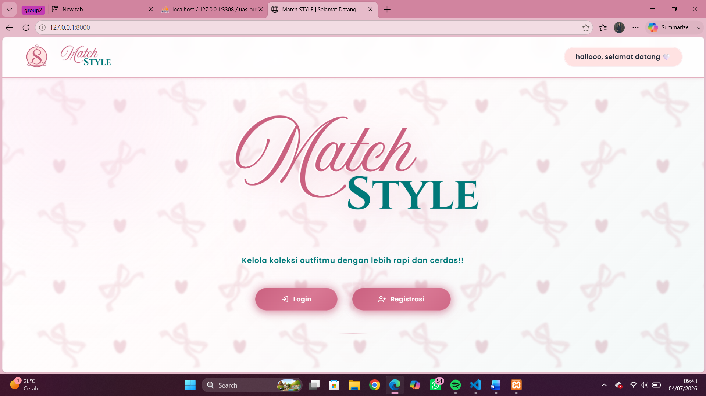

---

### 2. Halaman Registrasi
*(Pengujian proses pembuatan akun baru oleh pengguna dengan mengisi form pendaftaran)*

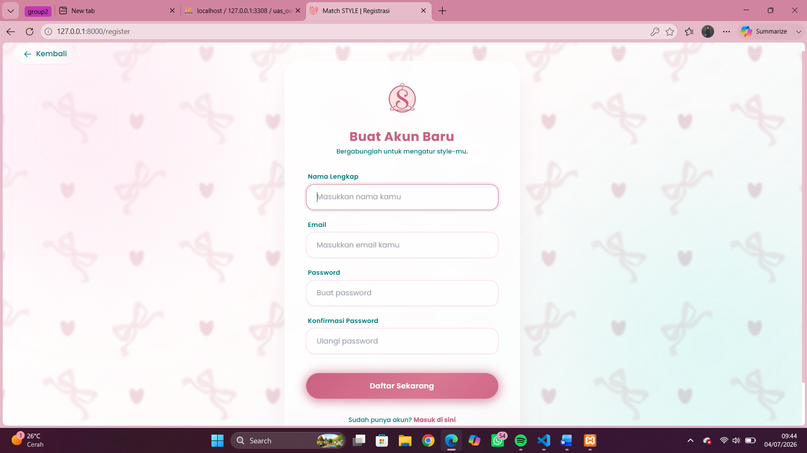

---

### 3. Halaman Login
*(Pengujian proses autentikasi saat pengguna masuk ke dalam sistem menggunakan akun yang sudah terdaftar)*

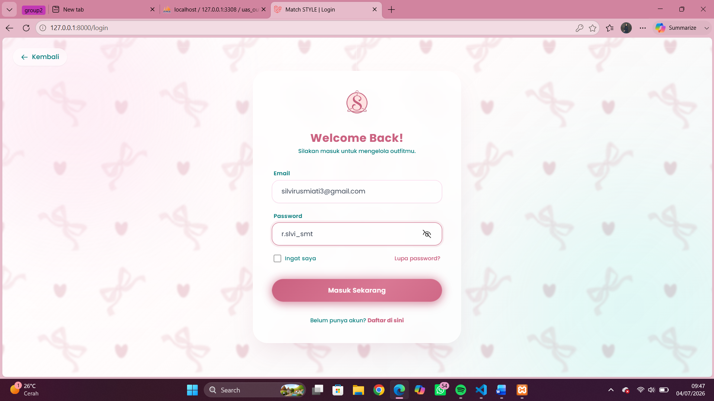

---

### 4. Halaman Dashboard Utama
*(Tampilan halaman utama dan navigasi setelah pengguna berhasil login ke dalam sistem)*

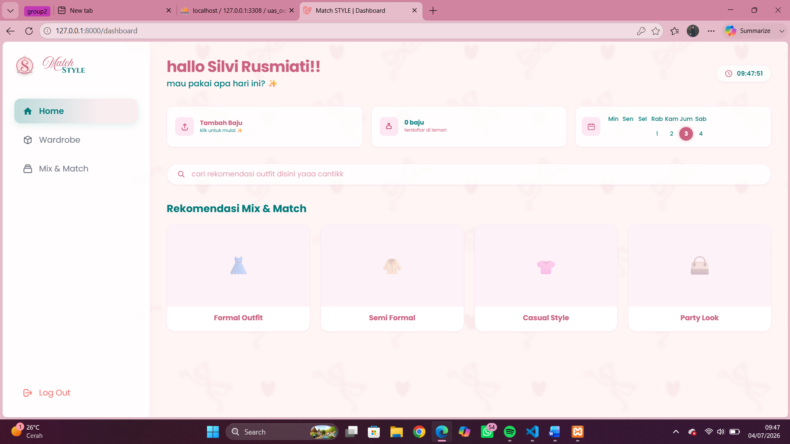

---

### 5. Halaman Wardrobe (Manajemen Lemari)
*(Menampilkan daftar koleksi pakaian pengguna yang telah diunggah ke sistem)*

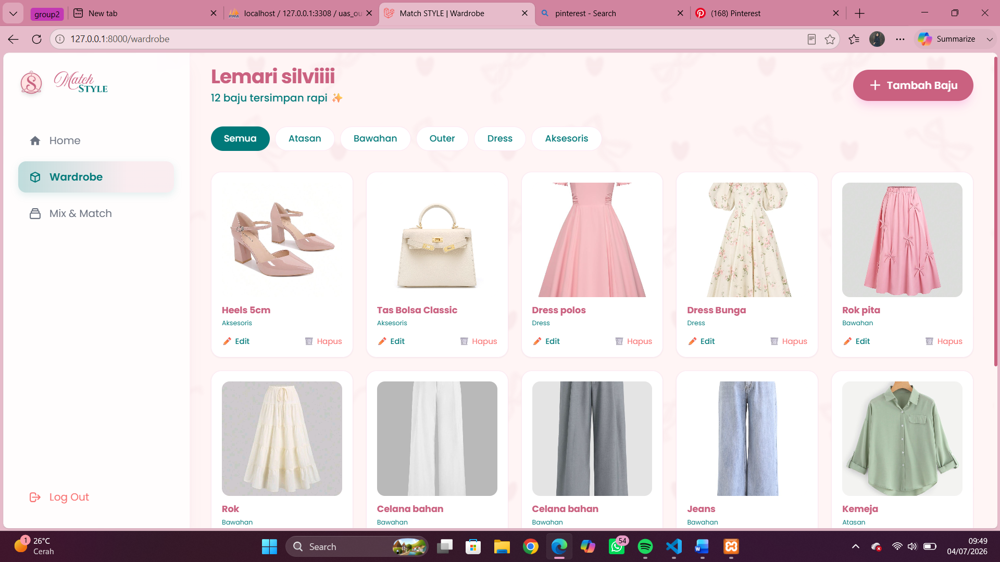

---

### 6. Fitur Pencarian Nama Pakaian
*(Pengujian fungsi pencarian spesifik untuk menemukan pakaian berdasarkan nama di dalam daftar koleksi Wardrobe)*

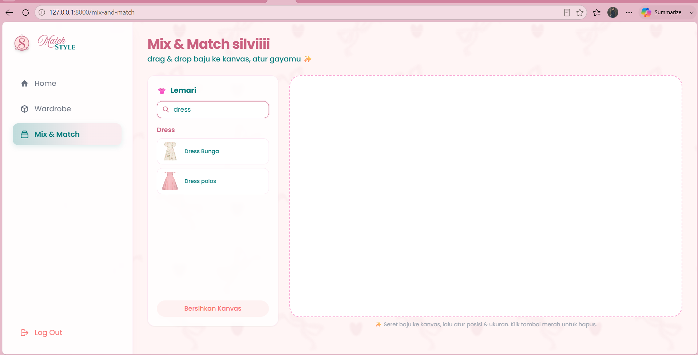

---

### 7. Fitur Filter Kategori
*(Pengujian fungsi filter untuk menampilkan koleksi pakaian berdasarkan kategori tertentu, seperti atasan, bawahan, dll)*

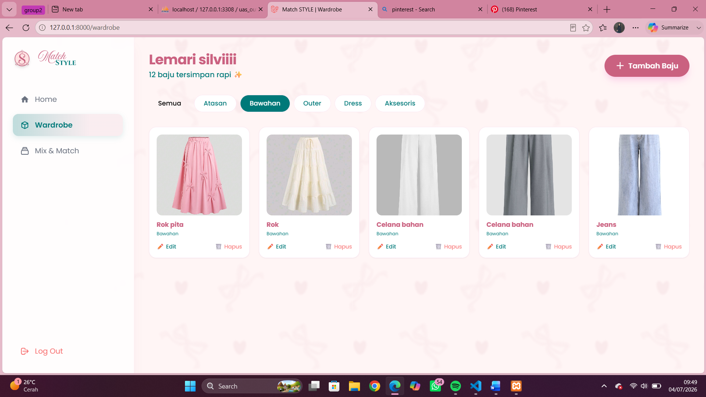

---

### 8. Fitur Pencarian Rekomendasi
*(Pengujian fitur pencarian/sistem yang menghasilkan rekomendasi padu padan gaya berdasarkan koleksi yang tersedia)*

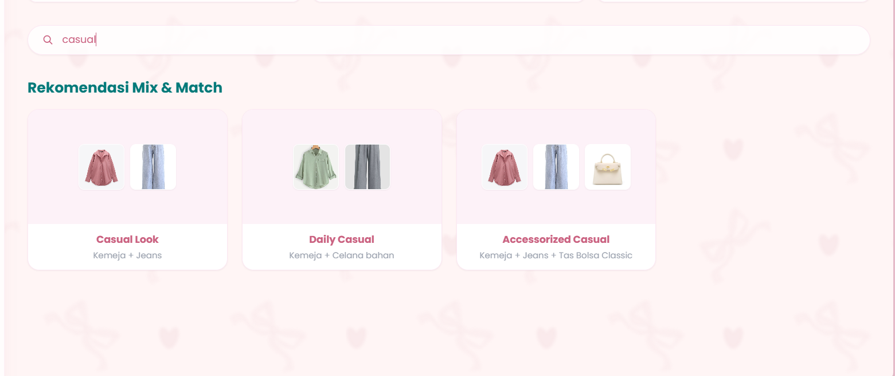

---

### 9. Proses Tambah Pakaian (Upload)
*(Pengujian form input data, validasi kolom, dan keberhasilan upload foto pakaian)*

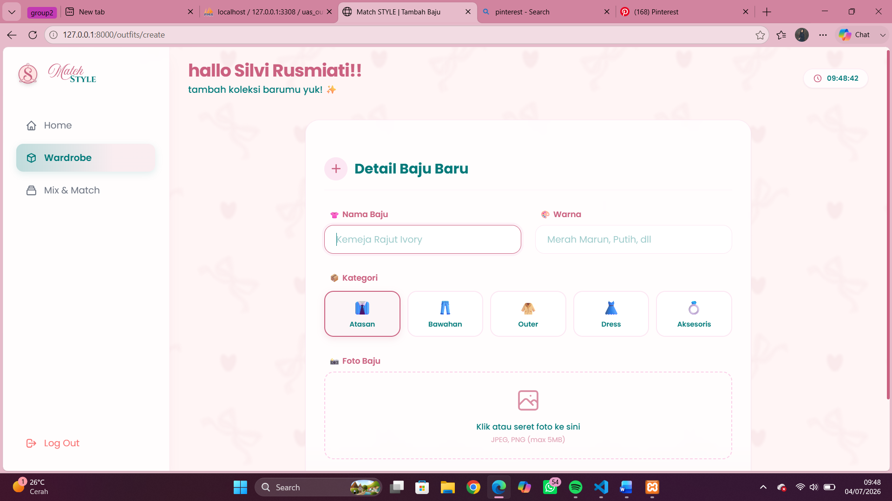

---

### 10. Halaman Edit Pakaian
*(Pengujian fitur untuk memperbarui atau mengubah detail informasi pakaian yang sudah tersimpan)*

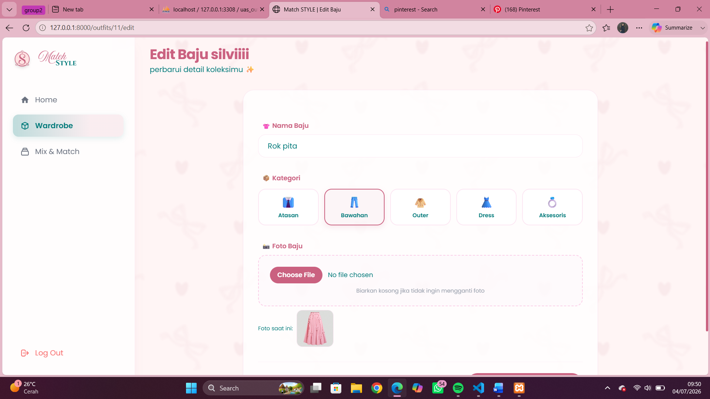

---

### 11. Ruang Canvas Mix & Match
*(Pengujian interaksi ruang kerja virtual untuk menyusun kombinasi gaya pakaian secara visual)*

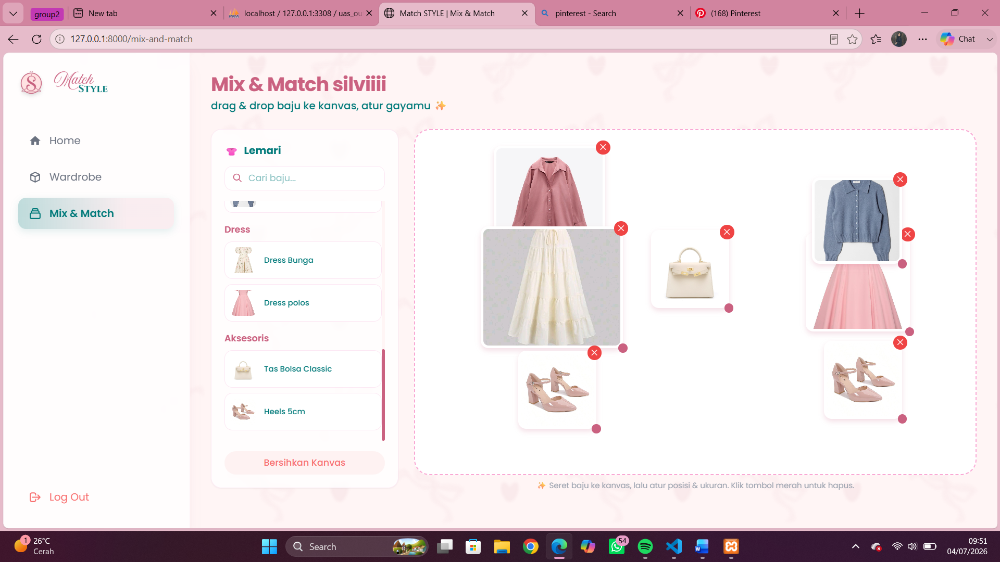

---

### 12. Struktur dan Data Database (Tabel Users)
*(Menampilkan struktur tabel dan contoh data pengguna yang berhasil tersimpan di dalam tabel `users` pada phpMyAdmin)*

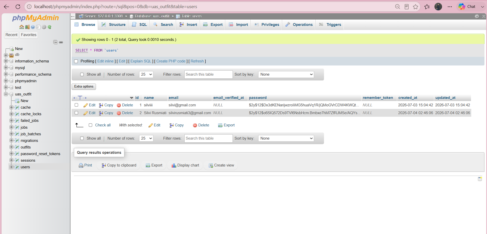

---

### 13. Struktur dan Data Database (Tabel Outfits)
*(Menampilkan struktur tabel dan contoh data pakaian yang berhasil diunggah dan tersimpan ke dalam tabel `outfits` pada phpMyAdmin)*

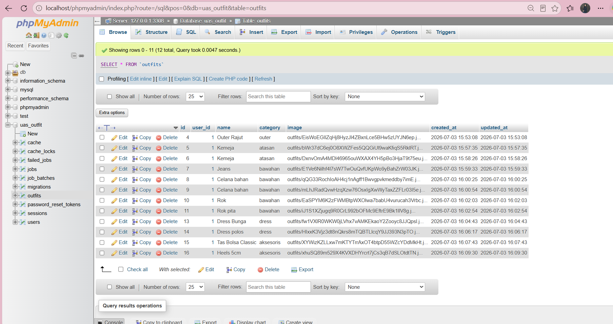